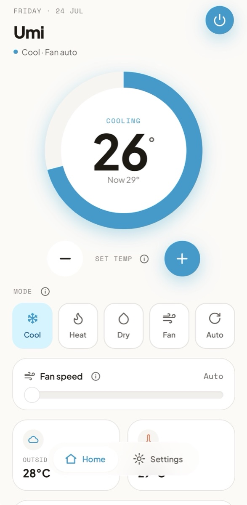
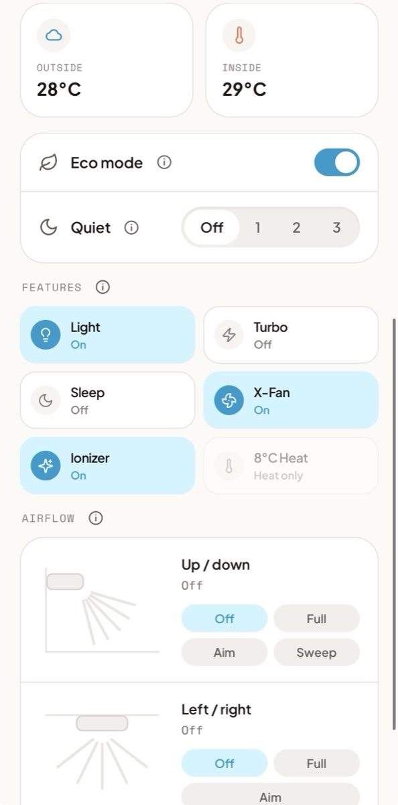

# GREE AC Control

Self-hosted local control for **GREE-based air conditioners**. No cloud, no
vendor app. A React PWA talks to a small Rust bridge on your LAN, and the
bridge speaks the **GREE local protocol** (Ewpe Smart, UDP port 7000) directly
to the AC.

**Works with any unit that pairs with the Ewpe Smart / GREE+ app.** That
includes hardware sold as GREE, Tosot, Cooper & Hunter, Sinclair, Inventor,
Argo, Daitsu, **Toyotomi**, and other rebrands. The reference unit for this
project is a Toyotomi Umi UTN/UTG-12CH; everything measured on it (feature
behavior, probe findings, what's inert) lives in
[docs/reference-unit.md](docs/reference-unit.md).

> **GREE, not Tuya.** If your unit pairs with Ewpe Smart or GREE+, it speaks
> GREE's local UDP protocol and this project applies. If it pairs only with a
> Tuya-based app, it does not. Firmware from about v1.21 uses AES-GCM
> encryption, older firmware AES-ECB; the bridge tries ECB first and falls
> back to GCM automatically.

<p align="center">
  
  &nbsp;&nbsp;
  
</p>

## How it works

```
PWA (React + TS, "Add to Home Screen")
  └── fetch + SSE → greehvacd, the Rust bridge (binary, container, or systemd)
                          │
                    GREE protocol → AC on LAN, UDP port 7000
```

- The PWA is a thin REST client and never sees the GREE protocol; the bridge
  returns friendly JSON (`{ power, targetTemp, mode, fanSpeed, ... }`).
- The bridge keeps one persistent, polled connection to the AC and reconnects
  with backoff. Changes are pushed to the app over SSE, so a change made on
  the physical remote shows up immediately.
- The bridge also serves the built PWA: one process, one URL on the LAN.
- Node is a build-time dependency only (Vite builds the PWA); the running
  system is a single Rust binary.

```
.
├── gree-hvac-rs/    Rust workspace: protocol crate + bridge daemon + probe
├── pwa/             React + Vite + Tailwind PWA
├── docs/            reference-unit findings, Pi runbook, remote access
├── .env             bridge config (AC_HOST, PORT, PUBLIC_DIR, ...)
└── docker-compose.yml
```

## Quick start

You need the AC's LAN IP and a [Rust toolchain](https://rustup.rs). GREE binds
locally: no cloud account, no key extraction. The bridge derives the device
key automatically on first connect.

1. Pair the AC with the **Ewpe Smart** app once, or confirm it is already on
   the Wi-Fi.
2. Find its IP (router DHCP table, or `nmap -p 7000 192.168.1.0/24`) and give
   it a DHCP reservation so it never drifts.
3. Build the app and start the bridge:

   ```bash
   cp .env.example .env                 # set AC_HOST to the AC's IP
   cd pwa && npm install && npm run build && cd ..
   cd gree-hvac-rs && cargo run -p greehvacd
   ```

4. Open `http://<host-ip>:8481` on your phone (same Wi-Fi), then
   *Share → Add to Home Screen*.

Sanity-check the bridge from another terminal:

```bash
curl http://localhost:8481/api/state
curl -X POST http://localhost:8481/api/power -H 'content-type: application/json' -d '{"on":true}'
```

If `/api/state` shows `"online": false`, set `GREE_LOG_LEVEL=debug` in `.env`
and watch the bind handshake. `cargo test --workspace` is also worth a run
first: it proves the AES-ECB/GCM implementation byte-identical to the
reference one before you point it at hardware.

**Full documentation:**

- [gree-hvac-rs/README.md](gree-hvac-rs/README.md): every endpoint, config
  flag, the state DTO, the read-only probe for undocumented property codes,
  and Pi Zero W cross-compilation.
- [pwa/README.md](pwa/README.md): app development, configuration
  (`VITE_DEVICE_NAME` and friends), and load-performance notes.
- [docs/remote-access.md](docs/remote-access.md): reaching the app from
  outside the house, and why it is built this way.
- [docs/pi-runbook.md](docs/pi-runbook.md): the Raspberry Pi Zero W setup,
  every deploy and diagnostic command.
- [docs/reference-unit.md](docs/reference-unit.md): what was measured on the
  Toyotomi Umi.

## Ways to run it

- **A Mac that's already at the house** (no server): double-click
  `run-ac.command`. It builds what changed, starts the bridge, holds off
  sleep, and prints the URL for your phone. Close the window to stop.
- **Docker on anything always-on**: `docker compose up -d --build` (host
  networking, so GREE's UDP traffic works reliably).
- **systemd on a Raspberry Pi Zero W** (what the reference setup runs):
  `./deploy-pi.command` from the repo root. It cross-compiles a static ARMv6
  binary, builds the PWA, ships both, and restarts the unit. First-time setup
  and every diagnostic live in [docs/pi-runbook.md](docs/pi-runbook.md).

To reach it from outside the house, the Pi joins a tailnet and `tailscale
serve` puts the app behind a real certificate, so one HTTPS URL works at home
and away. Setup, the one-origin rule, and the checks that actually prove it:
[docs/remote-access.md](docs/remote-access.md). Never port-forward the bridge.

## Security model

The default posture is **trusted LAN**: no auth, and no cross-origin access —
the bridge serves the PWA same-origin, so CORS stays off unless `CORS_ORIGIN`
opts in (only needed when the app runs elsewhere, e.g. the Vite dev server).
That is fine for a private home Wi-Fi and nothing else.

- **Never port-forward the bridge to the internet.** Use Tailscale or a
  Cloudflare Tunnel with access control for remote reach.
- **Set `API_TOKEN`** (defense-in-depth; generate one with
  `openssl rand -hex 32`) whenever anyone untrusted can join the network, or
  the bridge is reachable over a tunnel. Every `/api` request then needs
  `Authorization: Bearer <token>` (or `?token=` for `EventSource`, which can't
  send headers; note query tokens can land in access logs). The PWA sends the
  token from its Settings screen. The comparison is constant-time, and 401s
  use the same `{"error": ...}` envelope as every other failure.
- **Browser drive-by writes are blocked twice over**: every POST must carry
  `Content-Type: application/json`, which keeps cross-site writes out of the
  CORS "simple request" category and forces a preflight — and with CORS off by
  default, the preflight fails. A token still closes the gap for non-browser
  callers already on the network.
- The daemon logs a startup warning whenever `/api` runs without auth.
- Nothing in this repo contains device secrets. The GREE "generic" AES keys in
  the crypto layer are protocol constants every client implementation ships,
  and the per-device key is derived at bind time and held only in memory.

## Out of scope (v1)

- HomeKit/Siri (a Homebridge integration would be a separate project)
- Scheduling and automation
- Energy metering: the reference unit exposes none over WiFi, and a modelled
  estimate proved too inaccurate and was removed. Real numbers need external
  hardware (Shelly EM/PM).

## License

[MIT](LICENSE), for the whole repo: PWA, bridge, and protocol crates alike.

## Credits

The protocol implementation is a Rust port of
[`gree-hvac-client`](https://github.com/inwaar/gree-hvac-client), whose AES
known-answer vectors it carries as tests, so wire compatibility is proven
rather than assumed. Protocol reverse-engineering:
[tomikaa87/gree-remote](https://github.com/tomikaa87/gree-remote).
